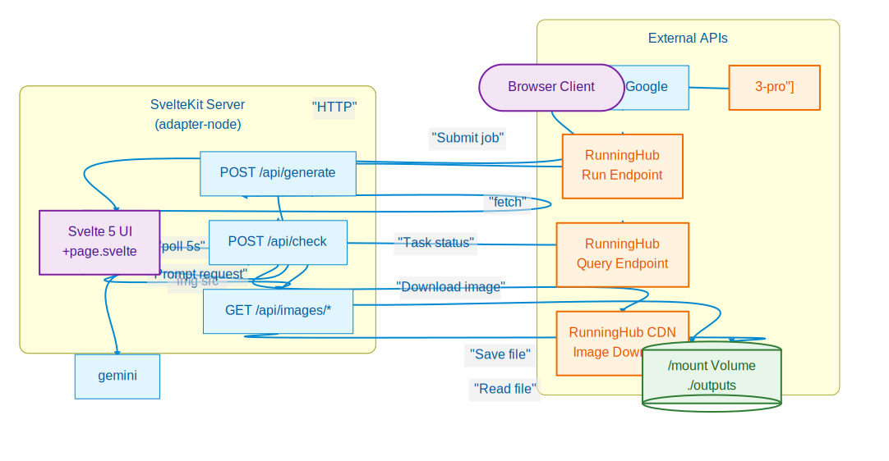
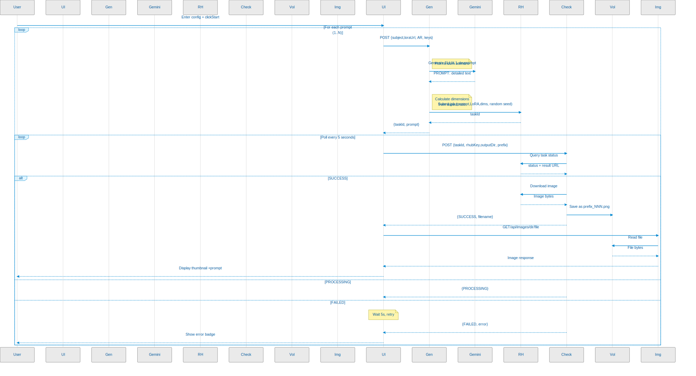

# rhub — RunningHub Precision Control Center

> **Advanced image generation control center. Features AI-orchestrated prompt engineering from 300 photogenic locations, multi-model generation (FLUX.1-dev via RunningHub, Z-Image via RunPod Serverless, and FLUX.2-klein via RunPod Serverless), sequential batch queuing, image upscaling with LSB steganography support, and real-time polling.**

**rhub** is a specialized SvelteKit-based dashboard that transforms simple subject descriptions into high-quality, LoRA-consistent imagery. It solves the "repetition problem" in AI generation by bridging expert prompt engineering (Gemini/Qwen) with multiple synthesis pipelines.

## Key Features

- **Multi-Model Generation** — Switch between **FLUX.1-dev** (RunningHub), **Z-Image** (RunPod Serverless), and **FLUX.2-klein** (RunPod Serverless) from the Generate tab. The same AI prompt engineering pipeline feeds all three models.
- **Expert Orchestration** — Google Gemini 3 Flash or RunPod Qwen 30B synthesizes detailed prompts via a 2-step process: location selection + AI composition. Each model has a specialized Prompt Director tuned for its strengths.
- **FLUX.2-klein Support** — 9B-parameter undistilled flow-match transformer by Black Forest Labs, with quality presets, LoRA hot-swap, optional detail refinement (2nd pass), and server-side upscaling.
- **Image Upscaling** — Batch upscale images to 2K resolution using specialized RunningHub workflows. Handles intermediary storage via S3 (e.g., Backblaze B2) with automatic presigned URL generation.
- **LSB Steganography (TT-Decoder/Encoder)** — Built-in TypeScript support for both extracting hidden data from generated images and **embedding data into carrier images** for secure upscale processing.
- **Persistent Sequential Queue** — Bypasses RunningHub's single-task limitation with a robust client-side queue. Captures full form state (LoRA, model, output dir, API keys) per task, survives page refreshes, and processes jobs one-by-one.
- **Environment-backed API Keys** — API keys can be pre-configured in `.env` and are automatically used as defaults. UI fields override them on a per-session basis.
- **Modern Tabbed UI** — Segmented control interface with smooth sliding indicators for seamless switching between Generation and Upscaling modes.
- **300 Curated Locations** — Module-level Fisher-Yates shuffled queue of 300 unique locations ensures zero repetition across large batches.
- **Flexible Dimensions** — 9 aspect ratio presets with automatic 16px-aligned dimension calculation.
- **Containerized Deployment** — Fully Dockerized with environment-based configuration for secrets and server limits.

## Architecture



The application runs as a single SvelteKit container. API routes handle server-side logic including AI prompt synthesis, S3 uploads, RunningHub interaction, and direct RunPod Serverless calls. Images are served directly from a Docker-mounted volume to prevent caching issues and ensure persistence.

## Data Flow



### Generation Flow — FLUX.1-dev (RunningHub)
1. User selects **FLUX.1-dev** model, provides subject characteristics, LoRA URL, and API keys.
2. Tasks are added to the **Persistent Queue**.
3. Background processor picks the next task:
    - AI selects a location and generates a vivid composition.
    - AI synthesizes the final detailed FLUX.1-dev prompt.
4. Dimensions are calculated and the task is submitted to RunningHub.
5. The client polls `/api/check` for status, downloads the result, and optionally decodes hidden data.

### Generation Flow — Z-Image (RunPod Serverless)
1. User selects **Z-Image** model and optionally sets inference steps, guidance scale, scheduler shift, LoRA scale, and seed.
2. Tasks are added to the **Persistent Queue** with the same AI prompt engineering pipeline.
3. Background processor picks the next task:
    - AI synthesizes the prompt (same Gemini/Qwen pipeline as FLUX.1-dev).
4. Job is submitted to the RunPod Z-Image Serverless endpoint (`/run`).
5. The client polls `/api/zimage-check` until the job completes, then downloads the JPG from the S3 URL returned by RunPod.
6. Optionally, a **High-Res Refinement** second pass is run server-side before delivery.

### Generation Flow — FLUX.2-klein (RunPod Serverless)
1. User selects **FLUX.2-klein** model, chooses a quality preset, and optionally sets inference steps, LoRA scale, seed, detail refinement, and upscaling options.
2. Tasks are added to the **Persistent Queue** with the same AI prompt engineering pipeline.
3. Background processor picks the next task:
    - AI synthesizes the prompt using the **FLUX Prompt Director** — a specialized system prompt tuned for FLUX.2 [klein] 9B (camera/film language, avoids SDXL boilerplate).
4. Job is submitted to the RunPod FLUX.2-klein Serverless endpoint (`/run`).
5. The client polls `/api/zimage-check` until the job completes, then downloads the JPEG from the S3 presigned URL returned by RunPod.

### Upscale Flow
1. User uploads images via the **Upscale** tab.
2. Background processor picks the next upscale task:
    - If **TT-Decoder** toggle is ON: The image is encoded into a new carrier PNG using **TT-Encoder**.
    - The image (original or encoded) is uploaded to S3 storage.
    - A temporary presigned URL is generated and sent to the RunningHub 2K Upscale workflow.
3. The client polls status and downloads the upscaled result.

## Quick Start

### Prerequisites

- [Docker](https://docs.docker.com/get-docker/) & Docker Compose
- A [Google Gemini API key](https://aistudio.google.com/apikey) or a [RunPod API key](https://www.runpod.io/)
- A [RunningHub API key](https://www.runninghub.ai/) (required for FLUX.1-dev and Upscaling)
- A [RunPod API key](https://www.runpod.io/) (required for Z-Image, FLUX.2-klein, and Qwen prompt provider)
- **S3-compatible Storage** (Required for Upscaling) — e.g., [Backblaze B2](https://www.backblaze.com/cloud-storage).

### Run with Docker (Recommended)

```bash
# Clone the repository
git clone <repo-url>
cd rhub

# Configure environment variables
cp .env.example .env
# Edit .env with your API keys, S3 credentials, and RunPod endpoints

# Ensure the shared Docker network exists
docker network create shared_net 2>/dev/null || true

# Build and start
docker compose up -d --build
```

## Configuration

API keys can be set in `.env` (recommended for persistent use) or entered directly in the Web UI. **UI values override `.env` values.**

### Environment Variables

| Variable | Required | Description |
|----------|----------|-------------|
| `RUNNINGHUB_API_KEY` | For FLUX.1-dev & Upscaling | RunningHub API key |
| `GEMINI_API_KEY` | For Gemini prompt provider | Google Gemini API key |
| `RUNPOD_API_KEY` | For Z-Image, FLUX.2-klein & Qwen provider | RunPod API key |
| `RUNPOD_ZIMAGE_ENDPOINT` | For Z-Image | Full RunPod endpoint URL (e.g. `https://api.runpod.ai/v2/<id>`) |
| `RUNPOD_FLUX_KLEIN_ENDPOINT` | For FLUX.2-klein | Full RunPod endpoint URL (e.g. `https://api.runpod.ai/v2/<id>`) |
| `S3_ENDPOINT` | For Upscaling | S3 API endpoint URL (e.g. `https://s3.us-west-004.backblazeb2.com`) |
| `S3_BUCKET` | For Upscaling | Name of the bucket for intermediary image storage |
| `S3_ACCESS_KEY_ID` | For Upscaling | S3 access key ID |
| `S3_SECRET_ACCESS_KEY` | For Upscaling | S3 secret access key |
| `S3_REGION` | For Upscaling | S3 region (default: `us-east-1`) |
| `BODY_SIZE_LIMIT` | Always | Maximum upload size in bytes (e.g., `52428800` for 50MB) |

### Web UI Settings

| Setting | Description |
|---------|-------------|
| **Generation Model** | Choose **FLUX.1-dev** (RunningHub), **Z-Image** (RunPod Serverless), or **FLUX.2-klein** (RunPod Serverless) |
| **AI Prompt Provider** | Choose between Google Gemini or RunPod (Qwen 30B) for prompt engineering |
| **RunningHub API Key** | Overrides `RUNNINGHUB_API_KEY` env var for this session |
| **Gemini API Key** | Overrides `GEMINI_API_KEY` env var for this session |
| **RunPod API Key** | Overrides `RUNPOD_API_KEY` env var for this session |
| **Enable TT-Decoder** | Toggle LSB steganography decoding/encoding (FLUX.1-dev only, persisted in localStorage) |

### Generation Parameters

#### Shared (all models)

| Parameter | Default | Description |
|-----------|---------|-------------|
| LoRA URL | *(empty)* | URL to a `.safetensors` LoRA file |
| LoRA Trigger Word | *(empty)* | Trigger word the LoRA was trained on (e.g. `TOK`). Injected as a hard rule into both prompt engineering steps. |
| Aspect Ratio | `1:1` | 9 presets — dimensions are auto-calculated at 16px alignment |
| Output Sub-directory | `generations` | Sub-folder inside `/mount` where results are saved |
| Filename Prefix | `image` | Prefix applied to all saved filenames |

#### Z-Image (RunPod Serverless)

| Parameter | Default | Description |
|-----------|---------|-------------|
| Inference Steps | `35` | Number of diffusion steps (10–50) |
| Guidance Scale | `2.5` | CFG scale |
| Scheduler Shift | `1.5` | FlowMatch scheduler shift |
| LoRA Scale | `0.85` | LoRA adapter strength |
| Seed | `-1` (random) | Fixed seed for reproducibility |
| Enable High-Res Refinement | off | Runs a second pass for extra detail and upscaling |
| ↳ Upscale Factor | `1.5` | Scale multiplier for the refinement pass |
| ↳ Denoising Strength | `0.18` | Img2img denoising strength for refinement |
| ↳ Pass 2 Guidance | `1.2` | CFG scale for the refinement pass |

#### FLUX.2-klein (RunPod Serverless)

| Parameter | Default | Description |
|-----------|---------|-------------|
| Quality Preset | `realistic_character` | Preset bundle: steps, guidance, shift, and resolution tuned for the use-case. Options: `realistic_character`, `portrait_hd`, `cinematic_full`, `fast_preview`, `maximum_quality` |
| Inference Steps | `35` | Number of diffusion steps — use 35–50 for the base (undistilled) model |
| LoRA Scale | `0.85` | LoRA adapter strength (0.75–0.9 recommended) |
| Seed | `-1` (random) | Fixed seed for reproducibility |
| Enable Detail Refinement | off | Runs a second inference pass to sharpen fine details and textures |
| ↳ Refinement Strength | `0.35` | Img2img denoising strength for the refinement pass |
| ↳ Refinement Steps | `20` | Inference steps for the refinement pass |
| ↳ Refinement Guidance | `1.0` | CFG scale for the refinement pass |
| Enable Upscaling | off | Upscales the generated image server-side before delivery |
| ↳ Upscale Factor | `2.0` | Scale multiplier (1.5–4×) |
| ↳ Upscale Blend | `0.25` | Blending factor between original and upscaled features |

## API Reference

### `POST /api/generate`
Submits an image generation job. Handles AI prompt engineering via Gemini or RunPod Qwen, then routes to the selected model backend.

- **FLUX.1-dev**: Submits to RunningHub workflow. Returns `{ taskId, model: 'flux-dev', prompt }`.
- **Z-Image**: Submits to RunPod Z-Image Serverless endpoint. Returns `{ jobId, model: 'z-image', prompt }`.
- **FLUX.2-klein**: Submits to RunPod FLUX.2-klein Serverless endpoint with preset, LoRA, optional 2nd pass, and optional upscale parameters. Returns `{ jobId, model: 'flux-klein', prompt }`.

### `POST /api/zimage-check`
Polls a RunPod job (Z-Image or FLUX.2-klein) for completion. When the job completes, downloads the image from the S3 presigned URL and saves it to the output directory. Returns `{ status, filename }`.

### `POST /api/upscale`
Handles multipart form uploads. Encodes images if requested, uploads to S3, and submits to specialized RunningHub upscaling workflows.

### `POST /api/check`
Polls RunningHub task status and handles post-processing (image download + optional TT-Decode).

### `GET /api/images/[...path]`
Serves generated/upscaled images from the mounted output volume.

## Project Structure

```
rhub/
├── src/
│   ├── lib/
│   │   ├── tt-decoder.ts             # LSB Steganography extraction
│   │   ├── tt-encoder.ts             # LSB Steganography embedding
│   │   ├── s3.ts                     # S3 Client & Presigned URL logic
│   │   └── locations.ts              # 300 photogenic locations
│   └── routes/
│       ├── +page.svelte              # Main UI (Runes) — Generate & Upscale tabs
│       ├── +page.server.ts           # Server load — passes env-backed API keys to UI
│       └── api/
│           ├── generate/             # AI Synthesis + Multi-model Submission
│           ├── zimage-check/         # RunPod job polling + image download (Z-Image & FLUX.2-klein)
│           ├── upscale/              # Upload + Encoding + S3 Hosting
│           ├── check/                # RunningHub task polling + TT-Decode
│           └── images/               # Static file serving from /mount
├── .env.example                      # Template for secrets and limits
├── .env                              # Local secrets (gitignored)
├── Dockerfile                        # Production build
└── docker-compose.yml                # Container orchestration
```

## Tech Stack

- **Frontend**: Svelte 5 (Runes), TypeScript, SvelteKit
- **Backend**: Node.js, AWS SDK (S3), pngjs
- **AI**: Gemini 3 Flash / RunPod Qwen 30B
- **Image Generation**: FLUX.1-dev (RunningHub) / Z-Image (RunPod Serverless) / FLUX.2-klein (RunPod Serverless)
- **Infrastructure**: Docker, Docker Compose

## License

Private — All rights reserved.
